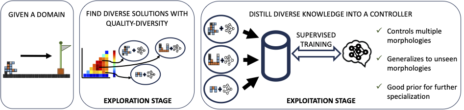

# Towards multi-morphology controllers

This is the code for the paper "Towards Multi-Morphology Controllers with Diversity and Knowledge Distillation"

## A *really* short summary

We use QD to build an archive of robot-controller pairs with distinct morphologies, optimized for the locomotion task. This archive can be distilled into a single controller that can also generalize well to unseen morphologies.

</img>

## Main components of the code

There are three main components:

1) [QD for domain exploration](src/main.py) -- runs MAP-Elites algorithm to build an archive of solutions.
2) [Dataset creation](src/create_dataset.py) -- takes an archive and creates a dataset by simulating individuals.
3) [Distillation](src/distill.py) -- takes a dataset and trains a network with it in a supervised fashion.

## Watch the behaviors of the robots

With a little bit of explanation as well:

https://github.com/mertan-a/towards-multi-morphology-controllers/assets/34231008/e4cf08af-ed28-47c1-a89a-6736ef25e236

