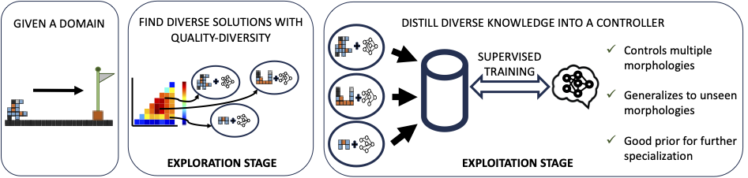

# Towards multi-morphology controllers

This is the code for the paper "Towards Multi-Morphology Controllers with Diversity and Knowledge Distillation"

## A *really* short summary

We use QD to build an archive of robot-controller pairs with distinct morphologies, optimized for the locomotion task. This archive can be distilled into a single controller that can also generalize well to unseen morphologies.

</img>

